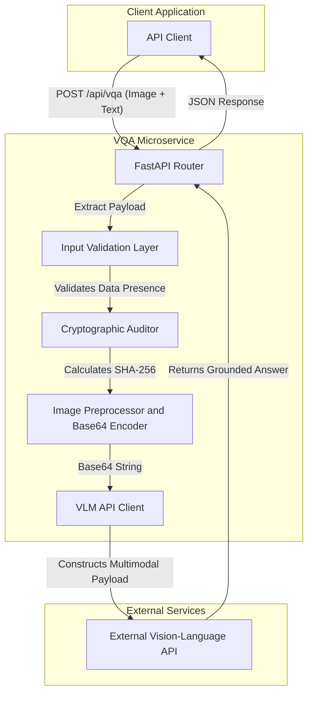
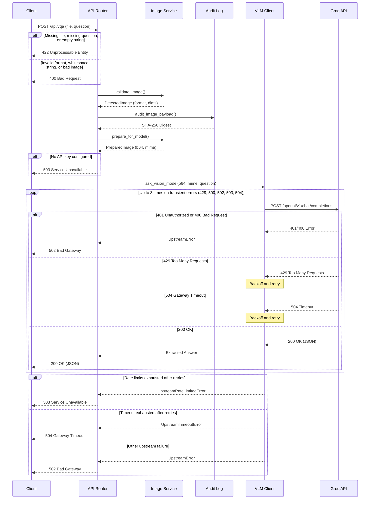

# Grounded Visual Question Answering API

This service provides a Visual Question Answering (VQA) endpoint that requires image payloads to be explicitly processed by the Vision-Language Model. Grounding means the model's text response must change demonstrably when the provided image changes, given the identical text question. The service logs the uploaded image bytes to an append-only audit log before routing the request to the `qwen/qwen3.8-27b` vision model via Groq.

## Architecture



| Component | File | Responsibility |
|---|---|---|
| FastAPI Router | `app/api/router.py` | Receives multipart requests, checks chunk sizes, enforces 413 caps and delegates processing. |
| Input Validation Layer | `app/services/image.py` | Decodes image headers via Pillow to reject corrupted files and unsupported types. |
| Cryptographic Auditor | `app/core/audit.py` | Computes SHA-256 of raw bytes and writes the record to `audit.log`. |
| Image Preprocessor | `app/services/image.py` | Corrects EXIF orientation, applies LANCZOS scaling to 1024px maximum, and encodes to base64. |
| VLM API Client | `app/services/vlm.py` | Structures the Chat Completion payload, handles API retries, and maps upstream errors. |

### Request Sequence



## Request Lifecycle

1. The FastAPI router accepts a multipart upload, verifying chunk limits and stopping early at 10 MiB.
2. The file is validated using Pillow to ensure it is a valid JPEG, PNG, or WebP.
3. The cryptographic auditor computes the SHA-256 hash of the exact raw bytes received, writing it to `audit.log` before any transformation.
4. The image preprocessor checks dimensions; if the longest side exceeds 1024 pixels, it downsizes using LANCZOS interpolation. Images smaller than 1024 pixels are passed unmodified byte-for-byte.
5. The processed image is converted to a base64 data URI.
6. The VLM client constructs the JSON body for the chat completion endpoint and executes the request, retrying up to 3 times on transient errors.

## API Reference

| Method | Path | Purpose |
|---|---|---|
| POST | `/api/vqa` | Answers a visual question based on an uploaded image. |
| GET | `/health` | Reports service readiness. |

**Example request**
```bash
curl -X POST http://localhost:8000/api/vqa \
  -F "file=@fixtures/image_a.jpg;type=image/jpeg" \
  -F "question=How many apples are on the table?"
```

**Example response**
```json
{
  "answer": "3"
}
```

**Error mapping**

| Condition | Status |
|---|---|
| Omitted `question` or `file`, or empty string value | 422 |
| Whitespace-only question, bad filename, non-image content type, undecodable image, zero-byte image, unsupported format, oversized pixel count | 400 |
| Upload above 10 MiB | 413 |
| No API key configured | 503 |
| Upstream rate limit after retries | 503 |
| Upstream timeout | 504 |
| Other upstream failure | 502 |
| Unexpected error | 500 |

## Configuration

| Variable | Required | Default | Description |
|---|---|---|---|
| VLM_PROVIDER | No | groq | Which backend provider to call (`groq` or `openai`). |
| GROQ_API_KEY | Yes* | None | API key for the Groq platform. |
| OPENAI_API_KEY | Yes* | None | API key for OpenAI fallback. |
| MAX_QUESTION_CHARS | No | 2000 | Maximum allowed length for the question text. |
| REQUEST_TIMEOUT_SECONDS | No | 60 | Maximum time to wait for the VLM to reply. |
| MAX_RETRIES | No | 3 | Maximum number of request attempts on transient errors. |
| MAX_UPLOAD_BYTES | No | 10485760 | Hard cap for multipart chunk processing (10 MiB). |
| MAX_IMAGE_DIMENSION | No | 1024 | Ceiling for the longest side; downsizes if larger. |
| MAX_ANSWER_TOKENS | No | 256 | Hard token cutoff for the completion response. |
| LOG_LEVEL | No | INFO | Application logging output level. |
| AUDIT_LOG_PATH | No | /app/audit.log | Absolute path to the audit log file. |

*\* At least one API key must be provided based on the selected provider.*

## Quick Start with Docker

1. Copy the configuration template:
   ```bash
   cp .env.example .env
   ```
2. Edit `.env` and set your `GROQ_API_KEY`. (The OpenAI provider is selected by setting `VLM_PROVIDER=openai` with an OpenAI key.)
3. Start the container:
   ```bash
   docker compose up --build -d
   ```
4. Wait for the service to report healthy via `docker ps`.
5. Issue a request:
   ```bash
   curl -X POST http://localhost:8000/api/vqa \
     -F "file=@fixtures/image_a.jpg" \
     -F "question=How many apples are on the table? Respond with only the number."
   ```

## Local Development

```bash
python3.12 -m venv .venv
source .venv/bin/activate
pip install -r requirements-dev.txt
uvicorn app.main:app --reload
```

Run tests and linting:
```bash
pytest
ruff check .
ruff format .
```

## Grounding Verification

The repository includes synthetic fixture images rendered strictly by `scripts/generate_fixtures.py` (not photographs) to prove the visual grounding of the endpoint.

| Image | Content | Question | Expected Substring |
|---|---|---|---|
| image_a.jpg | 3 red apples | "How many apples are on the table? Respond with only the number." | "3" |
| image_b.jpg | 5 red apples | "How many apples are on the table? Respond with only the number." | "5" |

You can automatically verify that the service processes the differences correctly by running:
```bash
python scripts/verify_requirements.py
```

**Real output observed from qwen/qwen3.8-27b (2026-10-10)**

| Target | 5-Run Answers |
|---|---|
| Image A (3 apples) | `{"answer": "3"}` (all 5 runs) |
| Image B (5 apples) | `{"answer": "5"}` (all 5 runs) |

## Audit Log

The exact bytes received from the client are hashed (SHA-256) and logged before any image transformation or scaling. The log uses the format:
`{timestamp} | {request_id} | {sha256_hash}`

Example record:
`2026-10-10T01:12:15.123+00:00 | c0d11fd9-bcff-4154-a8d6-2da09f710508 | d7b8f830b153442ff00cb075c9b64b11ddbfa9a393fe9e52e45312a6572e2f0a`

Cross-check via terminal:
```bash
shasum -a 256 fixtures/image_a.jpg
```

This is an append-only file written by the application.

## Design Decisions

- **Data URI over URL**: Groq and OpenAI vision endpoints require either a public URL or a base64 encoded string. Base64 is necessary for local file uploads, avoiding the overhead of external bucket storage.
- **Resize cap and pass-through**: Images are capped at 1024px to minimize VLM token costs. Images below 1024px are sent unmodified byte-for-byte to prevent degradation of small details.
- **Audit before preprocessing**: Hashing occurs immediately after extraction. This verifies exactly what the client sent, proving the bytes weren't altered or dropped before hitting the application logic.
- **Decoding instead of trusting the declared type**: Validating by running `Image.open` and decoding prevents spoofed file extensions and traps decompression bombs early. Relying solely on `Content-Type` headers is insecure.
- **422 vs 400 responses**: Missing fields return 422 (FastAPI standard logic), whereas empty text or corrupt data return 400 (Explicit application logic).
- **Retries only on transient statuses**: Retrying 401s, 403s, or 400s wastes resources. The client backs off explicitly only on timeouts, rate limits (429), or upstream 5xx errors.
- **Non-root container user**: The `Dockerfile` maps execution to `appuser` (UID 10001), lowering privileges.

## Project Layout

```
project_root/
├── app/
│   ├── __init__.py
│   ├── main.py              # FastAPI application initialization
│   ├── api/
│   │   ├── __init__.py
│   │   ├── router.py        # /api/vqa endpoint definitions
│   │   └── dependencies.py  # Dependency injection setup
│   ├── core/
│   │   ├── __init__.py
│   │   ├── config.py        # Environment variables and fallback logic
│   │   ├── audit.py         # SHA-256 hashing and logging utility
│   │   └── exceptions.py    # Typed error hierarchy
│   └── services/
│       ├── __init__.py
│       ├── vlm.py           # VLM API interaction and error mapping
│       ├── image.py         # Pillow validation and base64 scaling
│       └── orchestrator.py  # Ties validation, audit, scaling and model together
├── fixtures/
│   ├── image_a.jpg          # Grounding test fixture 1
│   ├── image_b.jpg          # Grounding test fixture 2
│   └── fixtures.json        # Test definitions
├── scripts/
│   ├── generate_fixtures.py # Draws synthetic apples via Pillow
│   └── verify_requirements.py # Runs the 10 core constraints checks
├── tests/                   # Pytest suite
│   ├── __init__.py
│   ├── conftest.py          # Shared pytest fixtures
│   ├── test_audit.py        # Audit logging tests
│   ├── test_config_files.py # Configuration validation tests
│   ├── test_image.py        # Image processing and validation tests
│   ├── test_validation.py   # API input validation tests
│   └── test_vlm.py          # VLM client and upstream integration tests
├── requirements.txt         # Pinned execution dependencies
├── requirements-dev.txt     # Pinned development and testing dependencies
├── pyproject.toml           # Tooling configurations (Ruff, pytest)
├── .env.example             # Configuration placeholders
├── .gitignore               # Git ignored files and directories
├── .dockerignore            # Docker context exclusions
├── docker-compose.yml       # Production Compose topology
├── Dockerfile               # Slim Linux service definition
├── README.md                # Project documentation
└── submission.json          # Selected VLM provider schema
```

## Troubleshooting

| Symptom | Likely Cause | Fix |
|---|---|---|
| HTTP 503 "Provider not configured" | API key missing from `.env` | Ensure `.env` exists and `GROQ_API_KEY` is set. |
| HTTP 503 "upstream rate limited" | API limits hit | Wait for the provider's rate limit window to clear. |
| HTTP 504 "upstream timed out" | VLM overloaded or offline | Retry; increase `REQUEST_TIMEOUT_SECONDS` if chronic. |
| Container unhealthy | Corrupted dependencies | Run `docker compose build --no-cache`. |
| Port already in use | Conflicting service | Kill the existing process bound to 8000 or change port mapping. |
